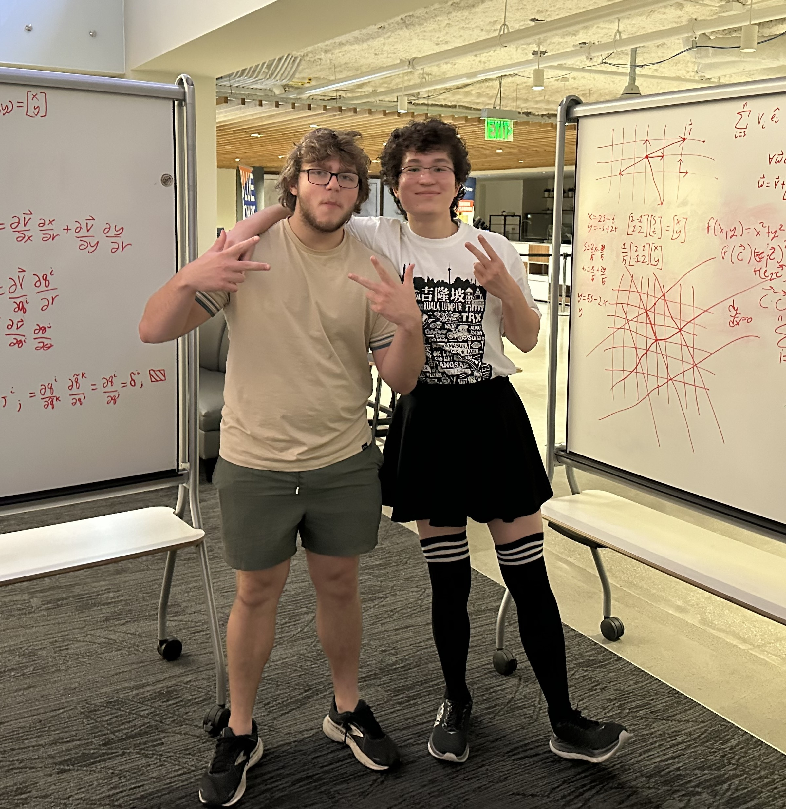

## Pieby Chess Engine

I started this project with Matt because I wanted to have an engine to call my own, one in a variant that doesn't have nearly as much support, neither in infrastructure for the developers nor theory for players. This engine is still a huge WIP, so updating the README beyond this will have to wait.

| Options     | Description | Allowed range |
|    :---:    |    :----:   |     :---:     |
|     N/A     |     N/A     |      N/A      |

## Current To-Do List

- [ ] Finish magic number generation for bitboards
- [X] Finish programming Zobrist hashing
- [X] Perform bitboard tests
- [X] Integrate bitboards into position representation
- [ ] Implement minimax / negamax search
- [X] Program FEN parsing
- [ ] Program PGN parsing
- [ ] Add Hash to options
- [ ] Add basic HCE evaluation so that thing functions on basic level
- [ ] Implement attacks.rs for pawns, king, and queen
- [ ] Finish pseudo-legal and legal movegen

## Notable Features

- Custom Zobrish hashing keys
- Black magic bitboards for sliding attack generation
 - Custom black magic numbers

## About the authors

Matt and I are college students at Georgia Tech. We started this project as a way to get into Rust and machine learning. It's going... decent, so far. Hopefully one day we can update that to "It was a total success!"

## Thanks and Acknowledgements

- The Stockfish Team, for their ubiquitous influence; when in doubt, do as Stockfish does.
- Viridithas, Princhess, and Rustic for reference on how to implement ideas cleanly in Rust. Matt and I had no prior knowledge of Rust starting this project, so existing strong Rust engines provided formative practice in attempting implementations and seeing just how much better it could be executed.